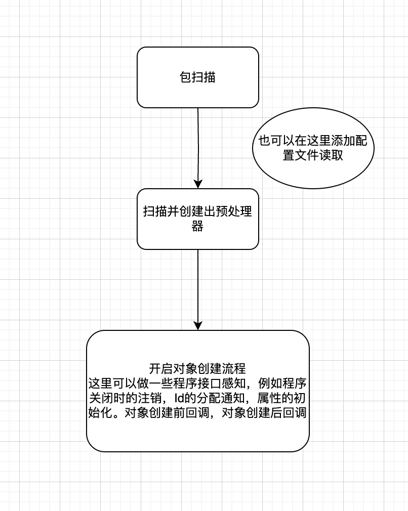
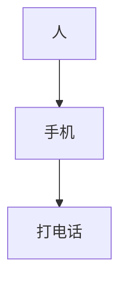

# 300行给你一个小型Ioc容器

本文专供于 ~~新手~~ 入门🤔

（代码去掉注释连三百行都没有哦）😁

（再去掉一些无关内容，预计得减半）😁

## 注意

- 仅供参考，以阐明Ioc容器到底是个什么东西，以及尝试编写一个小型的Ioc容器。
- stream到处都是，需要理解stream如何使用。
- 需要理解一下函数式编程。
  - 其实也很简单，本质上是在对象中保存了一段代码，以供需要时运行。
  - 又因为一系列的简化规则，所以看上去可能有点不明所以。
- 使用了高版本的Java特性，如果不支持该特性，去除即可，我会在代码中注明。

## 正文

由于Spring框架在Java历史中占据了举足轻重的地位，谈及Ioc容器就避免不了它。
Ioc容器是一个实现自动依赖注入的一个框架，它管理对象的创建和生命周期，并自动寻找到程序依赖注入到类中。可以将它理解为应用程序中组件仓库，你可以提供任何组件给它，它通过程序内容自动（是需要编写定义的）管理组件。

ps：当初是轻量级，现在是重量级+巨无霸

可以依据下面的完整代码来创建一个类似于Spring的Ioc容器，只需要添加一个包扫描，使用包扫描来扫描class字节码，通过classloader进行加载，加载完毕后就可以疯狂遍历里面的内容了，疯狂遍历！不要担心消耗CPU和内存，CPU速度非常快，这么点字节码占不了多少内存。

过程大致为



### 创建依赖链

例如人需要手机才能完成打电话，这时候关系就应该像这样。



打电话这个动作就需要手机来完成，手机需要人来使用，所以打电话这个动作的依赖关系是 打电话=>手机 =>人。

要创建这么一个依赖列表来支持打电话，就需要找到最底层的那个依赖（人），这时候我们可以通过某种递归形式来进行创建，你在写这些代码的时候甚至不知道自己写了一个精妙的递归。

要完成这个递归，我们只需要定义两个方法，一个用来创建对象，一个用来获取对象。

```java
//将context返回出去是为了链式调用，也可以不返回Context，将它修改为void即可
public interface Context{
    /**
     * 提供一个类对象，寻找里面的公开构造，创建出对象
     * @param type
     * @param name
     * @return
     */
    Context provide(Class<?> type, String name);

    /**
     * 获取一个对象
     * @param type
     * @return
     * @param <T>
     */
    <T> T solver(Class<T> type);    
}
```

让我们来看看创建对象方法的具体逻辑

```java
    //创建实例
   @Override
    public Context provide(Class<?> type, String name) {
        requireNonNull(type, "type is null");
        requireNonNull(name, "name is null");

        Object instance;
        try {
            final Object o = type.newInstance();
            instance = o;
        } catch (InstantiationException | IllegalAccessException e) {
            final var constructor = Arrays.stream(type.getConstructors())
                    .max(Comparator.comparingInt(Constructor::getParameterCount))
                    .orElseThrow(() -> new NullPointerException("no such public constructor"));
            final var args = Arrays.stream(constructor.getParameterTypes()).map(this::solver).toArray();
            try {
                instance = constructor.newInstance(args);
            } catch (InstantiationException | IllegalAccessException | InvocationTargetException ex) {
                throw new RuntimeException(ex);
            }

        }
        provide(instance, name);
        return this;
    }
    //获取实例
    @Override
    @SuppressWarnings("unchecked")
    public <T> T solver(Class<T> type) {
        var pairs = super.context.get(type);
        if (isNull(pairs)) {
            provide(type);
            pairs = super.context.get(type);
        }
        requireNonNull(pairs, String.format("类型%s不存在", type.getSimpleName()));
        final var o = pairs.get(0).second();
        requireNonNull(o, String.format("与%s对应的实例不存在", type.getSimpleName()));
        return (T) o;
    }
```

provide方法获取了两个参数，一个需要被创建出来的类型，一个是与之对应的名称,它做了两件事，直接使用无参构造进行创建对象，无法创造对象就使用全参构造来查找参数并创建实例。

查找的时候使用的是`<T> T solver(Class<T> type)`方法，我们在如果在solver方法中发现当前类的实例还没被创建，则调用`Context provide(Class<?> type)`进行类的创建。

与所有递归一样，如果能找到一个可用的解，则整个被构建类的构建链就会正常运转，如果无法正常运转就表明这条依赖链是错误的，应该好好思考自己的代码依赖关系了。
（如果发现有人写代码依赖都能写循环，还不知道为什么的，那就快跑🏃🚨）

这两个是ioc容器最核心的方法，其它的都是锦上添花，不要担心数据量或数据结构的复杂性带来的耗时，
因为最大的耗时永远都在IO，创建这么点数据炸不了机器，内存也该用就用。

### 在已被创建的实例池中通过某一特性来获取集合

在下面的完整代码中，定义了这么一个接口

```java
<T, Coll extends Collection<T>> Coll collect(Class<T> type, Supplier<? extends Coll> container);
```

在我的定义中，它通过接收一个class对象和一个供给者供给`Collection`方法进行调用，判断type是接口还是类定义来进行查找内容，在我的构思中，应该在一个地方一次对这些内容配置完毕，不应该东一个，西一个。

所以我假设了在方法运行完毕后，不应该再提供内容给容器，所以我在抽象类中定义了一个查询缓存，先去缓存中查找，缓存中找不到再开始运行真正的查询方法。

由于Java是可被擦除的泛型，所以将带泛型接口传进去查询出来的将会是是所有实现了该泛型的对象，需要自行对内容进行判断。

**这是定义在抽象类中的查询方法.**

```java
    protected final Map<Class<?>, Collection<Object>> cache = new HashMap<>();

    @SuppressWarnings("unchecked")
    protected <T> Collection<T> search(Class<T> type) {
        if (type == null) {
            throw new NullPointerException("type are null");
        }
        if (cache.containsKey(type)) {
            return (Collection<T>) cache.get(type);
        }
        if (type.isInterface()) {
            return searchByInterface(type);
        } else {
            return searchByType(type);
        }
    }

    /**
     * 通过类型搜索
     *
     * @param type
     * @param <T>
     * @return
     */
    private <T> Collection<T> searchByType(Class<?> type) {
        return searchByAction(type, entry -> entry.getKey().equals(type));
    }

    /**
     * 通过接口搜索
     *
     * @param interfaceType
     * @param <T>
     * @return
     */
    private <T> Collection<T> searchByInterface(Class<?> interfaceType) {
        return searchByAction(interfaceType, entry -> Arrays.asList(entry.getKey().getInterfaces()).contains(interfaceType));
    }

    @SuppressWarnings("unchecked")
    private <T> Collection<T> searchByAction(Class<?> type, Predicate<Map.Entry<Class<?>, List<Pair<String, Object>>>> action) {
        try {
            final var result = context
                    .entrySet()
                    .stream()
                    .filter(action)
                    .map(Map.Entry::getValue)
                    .flatMap(Collection::stream)
                    .map(Pair::second)
                    .toList();
            cache.put(type, result);

            return (Collection<T>) result;
        } catch (Exception e) {
            return null;
        }
    }
```

通过类型进行搜索和通过接口进行搜索只有在过滤方法才会有具体的差别，所以我将其抽象出来成为一个单独的方法，分别定义两个方法的搜索逻辑，该`search`方法为子类方法的`collect`进行了支持。

使用方法如下，可以将下面三个变量打印出来看看内容。

```java
final var context = AppContent.create("app")
                .provide("卧槽","config")
                .provide("2")
                .provide(1)
                .provide(3);
        final var strings = context.collect(String.class, ArrayList::new);
        final var integers = context.collect(Integer.class, ArrayList::new);
        final var charSequences = context.collect(CharSequence.class, ArrayList::new);
```

## 完整代码

```java
package com.cqsd.dl;

import java.lang.reflect.Constructor;
import java.lang.reflect.InvocationTargetException;
import java.util.*;
import java.util.function.Predicate;
import java.util.function.Supplier;

import static java.util.Objects.isNull;
import static java.util.Objects.requireNonNull;

/**
 * @author caseycheng
 * @date 2023/6/30-20:56
 **/
//低版本Java把 sealed 和permits BaseContext 删除即可
public sealed interface Context permits BaseContext {
    /**
     * 提供一个对象，它的名字为它自己的hashcode
     *
     * @param o
     * @return
     */
    Context provide(Object o);

    /**
     * 提供一个对象，并给予一个名字
     *
     * @param o
     * @param name
     * @return
     */
    Context provide(Object o, String name);

    /**
     * 提供一个类对象，寻找里面的公开构造，创建出对象
     *
     * @param type
     * @param name
     * @return
     */
    Context provide(Class<?> type, String name);

    /**
     * 提供一个类让dl进行创建
     *
     * @param type
     * @return
     */
    Context provide(Class<?> type);

    /**
     * 获取一个对象
     *
     * @param type
     * @param <T>
     * @return
     */
    <T> T solver(Class<T> type);

    /**
     * 通过name获取一个对象
     *
     * @param name
     * @param <T>
     * @return
     */
    <T> T solver(String name);

    /**
     * 通过name和class获取一个对象
     *
     * @param type
     * @param name
     * @param <T>
     * @return
     */
    <T> T solver(Class<T> type, String name);

    /**
     * 获取某个类型的集合
     * 如果是接口类型，就检索所有值的该接口，并返回集合
     *
     * @param type      类型
     * @param container 需要被放入的容器
     * @param <T>       类型
     * @return 容器
     */
    <T, Coll extends Collection<T>> Coll collect(Class<T> type, Supplier<? extends Coll> container);

    /**
     * 获取上下文名称
     *
     * @return
     */
    String getName();
}

record Pair<A, B>(A first, B second) {
    public static <A, B> Pair<A, B> createNotNull(A first, B second) {
        requireNonNull(first, "first is null");
        requireNonNull(second, "first is null");
        return new Pair<>(first, second);
    }

    public static <A, B> Pair<A, B> createNullable(A first, B second) {
        return new Pair<>(first, second);
    }
}
// 不支持record的用这个。
class Pair<A,B>{
    private final A first;
    private final B second;

    private Pair(A first,B second){
        this.first=first;
        this.second=second;
    }

    public static <A, B> Pair<A, B> createNotNull(A first, B second) {
        requireNonNull(first, "first is null");
        requireNonNull(second, "first is null");
        return new Pair<>(first, second);
    }

    public static <A, B> Pair<A, B> createNullable(A first, B second) {
        return new Pair<>(first, second);
    }

}

//低版本jdk删除non-sealed即可
abstract non-sealed class BaseContext implements Context {
    // env name
    private final String name;
    // map[key:class,value: List:name instance] 不写名字的就给一个类型名首字母小写
    protected final Map<Class<?>, List<Pair<String, Object>>> context = new HashMap<>();
    //对[collection]接口的查询缓存
    protected final Map<Class<?>, Collection<Object>> cache = new HashMap<>();

    public BaseContext(String envName) {
        requireNonNull(envName, "The name of the environment is required");
        this.name = envName;
    }

    /**
     * 提供给子类设置对象的方法，这里只管添加
     *
     * @param o    实例
     * @param name 实例名
     */
    protected void addObject(Object o, String name) {
        final Class<?> key = o.getClass();
        if (!context.containsKey(key)) {
            context.put(key, new ArrayList<>());
        }
        context.get(key).add(Pair.createNotNull(name, o));
    }

    /**
     * 通过类型或接口进行寻找
     *
     * @param type
     * @param <T>
     * @return
     */
    @SuppressWarnings("unchecked")
    protected <T> Collection<T> search(Class<T> type) {
        if (type == null) {
            throw new NullPointerException("type are null");
        }
        if (cache.containsKey(type)) {
            return (Collection<T>) cache.get(type);
        }
        if (type.isInterface()) {
            return searchByInterface(type);
        } else {
            return searchByType(type);
        }
    }

    /**
     * 通过类型搜索
     *
     * @param type
     * @param <T>
     * @return
     */
    private <T> Collection<T> searchByType(Class<?> type) {
        return searchByAction(type, entry -> entry.getKey().equals(type));
    }

    /**
     * 通过接口搜索
     *
     * @param interfaceType
     * @param <T>
     * @return
     */
    private <T> Collection<T> searchByInterface(Class<?> interfaceType) {
        return searchByAction(interfaceType, entry -> Arrays.asList(entry.getKey().getInterfaces()).contains(interfaceType));
    }

    @SuppressWarnings("unchecked")
    private <T> Collection<T> searchByAction(Class<?> type, Predicate<Map.Entry<Class<?>, List<Pair<String, Object>>>> action) {
        try {
            final var result = context
                    .entrySet()
                    .stream()
                    .filter(action)
                    .map(Map.Entry::getValue)
                    .flatMap(Collection::stream)
                    .map(Pair::second)
                    .toList();
            cache.put(type, result);

            return (Collection<T>) result;
        } catch (Exception e) {
            return null;
        }
    }


    @Override
    public String getName() {
        return this.name;
    }
}

class AppContent extends BaseContext {
    private AppContent(String envName) {
        super(envName);
    }

    public static Context create(String name) {
        return new AppContent(name);
    }

    /**
     * 提供一个对象，它的名字为它自己的hashcode
     *
     * @param o
     * @return
     */
    @Override
    public Context provide(Object o) {
        this.provide(o, String.valueOf(Objects.hashCode(o)));
        return this;
    }

    /**
     * 提供一个对象，并给予一个名字
     *
     * @param o
     * @param name
     * @return
     */
    @Override
    public Context provide(Object o, String name) {
        requireNonNull(o, "instance is null");

        super.addObject(o, name);
        return this;
    }

    /**
     * 提供一个类对象，寻找里面的公开构造，创建出对象
     *
     * @param type
     * @param name
     * @return
     */
    @Override
    public Context provide(Class<?> type, String name) {
        requireNonNull(type, "type is null");
        requireNonNull(name, "name is null");

        Object instance;
        try {
            final Object o = type.newInstance();
            instance = o;
        } catch (InstantiationException | IllegalAccessException e) {
            final var constructor = Arrays.stream(type.getConstructors())
                    .max(Comparator.comparingInt(Constructor::getParameterCount))
                    .orElseThrow(() -> new NullPointerException("no such public constructor"));
            final var args = Arrays.stream(constructor.getParameterTypes()).map(this::solver).toArray();
            try {
                instance = constructor.newInstance(args);
            } catch (InstantiationException | IllegalAccessException | InvocationTargetException ex) {
                throw new RuntimeException(ex);
            }

        }
        provide(instance, name);
        return this;
    }

    /**
     * 提供一个类让dl进行创建
     *
     * @param type
     * @return
     */
    @Override
    public Context provide(Class<?> type) {
        return provide(type, String.valueOf(Objects.hashCode(type)));
    }

    /**
     * 获取一个对象
     *
     * @param type
     * @param <T>
     * @return
     */
    @Override
    @SuppressWarnings("unchecked")
    public <T> T solver(Class<T> type) {
        var pairs = super.context.get(type);
        if (isNull(pairs)) {
            provide(type);
            pairs = super.context.get(type);
        }
        requireNonNull(pairs, String.format("类型%s不存在", type.getSimpleName()));
        final var o = pairs.get(0).second();
        requireNonNull(o, String.format("与%s对应的实例不存在", type.getSimpleName()));
        return (T) o;
    }

    /**
     * 通过name获取一个对象
     *
     * @param name
     * @param <T>
     * @return
     */
    @Override
    @SuppressWarnings("unchecked")
    public <T> T solver(String name) {
        requireNonNull(name, "请输入name");
        final var result = super.context.values()
                .stream()
                .flatMap(Collection::stream)
                .filter(pair -> pair.first().equals(name))
                .findFirst();
        result.orElseThrow(() -> new NullPointerException(String.format("名为%s的对象不存在", name)));
        return (T) result.get();
    }

    /**
     * 通过name和class获取一个对象
     *
     * @param type
     * @param name
     * @param <T>
     * @return
     */
    @Override
    @SuppressWarnings("unchecked")
    public <T> T solver(Class<T> type, String name) {
        requireNonNull(type, "type is null");
        requireNonNull(name, "name is null");
        final var list = super.context.get(type);
        requireNonNull(list, String.format("类型为%s的内容尚未提供", type.getSimpleName()));
        for (Pair<String, Object> pair : list) {
            if (pair.first().equals(name)) {
                return (T) pair.second();
            }
        }
        throw new NullPointerException(String.format("名为%s的对象不存在", name));
    }

    /**
     * 获取某个类型的集合
     * 如果是接口类型，就检索所有值的该接口，并返回集合
     *
     * @param type      类型
     * @param container 需要被放入的容器
     * @return 容器
     */
    @Override
    public <T, Coll extends Collection<T>> Coll collect(Class<T> type, Supplier<? extends Coll> container) {
        final var result = super.search(type);
        final var ts = container.get();
        if (isNull(result)) {
            ts.addAll(Collections.emptyList());
        } else {
            ts.addAll(result);
        }
        return ts;
    }
}
```
