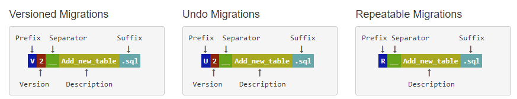

# flyway数据库版本控制

flyway是一款对数据库进行版本控制的程序，对你的应用程序添加该依赖后可以让你的程序自动对数据库进行SQL操作，例如对数据的删改，对字段的增减。

## 配置flyway

### 添加依赖

在你的build.gradle.kts中加入以下坐标，maven将三部分拆分以下就行。

```kotlin
implementation ("org.flywaydb:flyway-core:8.4.2")
```

### 配置迁移

```kotlin
val flyway = Flyway.configure().dataSource(dataSource).load()
flyway.migrate()
```

你看，这是不是非常简单？仅需一行代码就可完成对数据库的迁移配置，但是还没完，对数据库脚本的命名规则才是flyway的核心。

### 命名规则

在resource目录下创建路径为`db/migration`的文件夹，并在里面放入你编写的SQL脚本。

FlyWay 将SQL脚本分为三种：

- Versioned用于进行版本升级，每个版本都有唯一的版本号并且只能够执行一次。
- Repeatable可重复执行，当Flyway检查到R类型的脚本校验和有变动的时候，FlyWay就会重新运行该脚本，它总是在V执行结束后开始执行。
- Undo用于撤销具有相同版本化迁移带来的影响。不推荐使用，建议使用V模式来解决。并且U是商业功能，社区版本并不提供。

```admonish warning
文件系统可能大小写不敏感，但是FlyWay大小写敏感。
```



### 参考链接

[flyway-roll-back](https://www.baeldung.com/flyway-roll-back)

[flyway：文件命名很重要](https://www.red-gate.com/blog/database-devops/flyway-naming-patterns-matter)