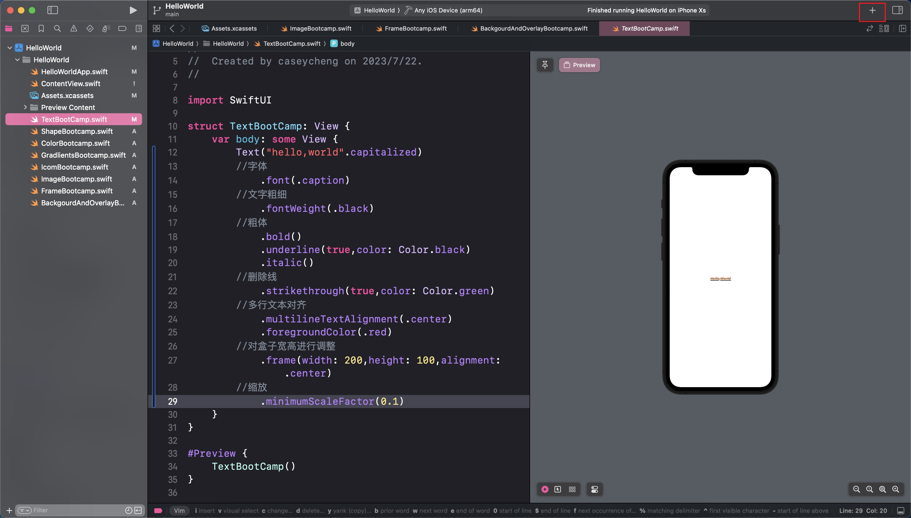

# swift-ui

> 基于B站视频[iOS&MacOS开发 SwiftUI 62集入门教程（中英字幕）-哔哩哔哩](https://b23.tv/RlXOohu)编写的笔记。
>
> 本人使用的Xcode-15-Beta.4进行学习。

## 一些杂七杂八的资源

| 资源名        | link                                             | 功能描述       |
| :------------ | ------------------------------------------------ | -------------- |
| Xcodes        | <https://github.com/XcodesOrg/xcodes>              | 管理Xcode 版本 |
| Apple设计资源（国内）| <https://developer.apple.com/cn/design/resources/> | 设计资源网站   |
|Apple设计资源（国外）|<https://developer.apple.com/design/resources/>|Design Resources site|

## 笔记

<!-- toc -->

### 布局与控件

swift-ui采用声明式写法，一系列修饰符都可以使用链式调用添加到后面。

控件可以在Xcode的右上角点击加号打开选项卡进行控件选择，这对我们查控件文档很有帮助。



#### Text

```swift
//.capitalized是大写选项卡
Text("hello,world".capitalized)
        //字体
            .font(.caption)
        //文字粗细
            .fontWeight(.black)
        //使用粗体
            .bold()
        //下划线
            .underline(true,color: Color.black)
        //使用拉丁字体
            .italic()
        //文字删除线
            .strikethrough(true,color: Color.green)
        //基线偏移量
            .baselineOffset(-10.0)
        //在每个字之间添加一点间距
            .kerning(1.0)
        //多行文本对齐方式
            .multilineTextAlignment(.center)
        //文字前景色
            .foregroundColor(.red)
        //添加一个盒子对内容进行限制
            .frame(width: 200,height: 100,alignment: .center)
        //缩放
            .minimumScaleFactor(0.1)
```

#### Creating Shapes

`.fill`和`.foregroundColor`的区别是前者为指定的形状填充颜色，后者会改变文本和模版渲染元素的颜色。

```swift
// Ellipse()
//Capsule(style: .continuous)
RoundedRectangle(cornerRadius: 10.0)
//Circle()
        //填充颜色
        //.fill(.red)
        //描边
        //.stroke(Color.blue,style: StrokeStyle(lineWidth: 30,lineCap: .round,dash: [40]))
        //修剪✂️
        //.trim(from: 0.2,to: 1)
        //.stroke(Color.pink,lineWidth: 30)
        //设置前景色 会改变文本和模版渲染元素的颜色。
        //.foregroundColor(.green)
        //.frame(width: 300,height: 200)
```

将这些修饰符组合起来，可以获得一些非常好的效果。

#### Color

`Color.primary`会自动根据设备的显示模式(深色模式&浅色模式)来切换黑白。

我们还可以在`Assets.xcassets`中自定义自己的颜色，由于视频里面的代码中使用的拾色器在这个版本中找不到（根据弹幕内容，这个功能好像无了。），所以只能在`Assets.xcassets`中设置颜色。

在`Assets.xcassets`中设置完颜色后，就可以在代码中使用这个颜色了，在构造Color的时候传入在`Assets.xcassets`中自定义颜色的名称即可使用。

#### Gradients

做设计的时候不要使用颜色太过于激烈的渐变

- linear gradinets 线性渐变
- angular gradients 径向渐变
- radial gradients 角度渐变

```swift
RoundedRectangle(cornerRadius: 25.0)
            .fill(
                //线性渐变
//                LinearGradient(
//                    //色彩
//                    gradient:Gradient(colors: [Color.red, Color.blue,Color.orange,Color("CustomColor")]),
//                    //开始位置
//                    startPoint: .topLeading,
//                    //结束位置
//                    endPoint: .bottomTrailing
//                )
                //径向渐变
//                RadialGradient(
//                    colors: [Color.red,Color.green],
//                    center: .topLeading,
//                    startRadius: 5,
//                    endRadius: 400
//                )
                //角度渐变
//                AngularGradient(
//                    gradient: Gradient(colors: [Color.primary, Color.blue]),
//                    center: .bottomTrailing,
//                    angle: .degrees(180+45)
//                )
            )
            .frame(width: 300,height: 200)
```

#### System Icon

可以使用apple设计资源网站中获取的SF symbols，里面可以检查并使用系统自带的一些图标。

```swift
        Image(systemName: "person.fill.badge.plus")
        //渲染模式
            .renderingMode(.original)
        //自动调整大小
//            .resizable()
            .font(.largeTitle)
        //缩放以适应盒子
//            .scaledToFit()
        //按照比例来填充盒子
//            .scaledToFill()
        //盒子大小
//            .frame(width: 300,height: 300)
        //前景色
            .foregroundColor(.yellow)
        //裁剪超出边框的部分
            .clipped()
            
```

#### Image

```swift
        Image(systemName: "person.fill.badge.plus")
            .renderingMode(.original)
//            .resizable()
            .font(.largeTitle)
            .scaledToFit()
//            .scaledToFill()
//            .frame(width: 300,height: 300)
            .foregroundColor(.yellow)
        //裁剪超出边框的部分
//            .clipped()
```

#### Farme

```swift
//        Text("Hello, World!")
//            .frame(width: 100)
//            .background(Color.blue)
//        //设置最大宽度为无穷，最大高度为无穷
//            .frame(maxWidth: .infinity,maxHeight: .infinity,alignment: .topLeading)
//            .background(Color.red)
        Text("Hello World!@")
            .background(Color.red)
            .frame(height: 100)
            .background(Color.orange)
            .frame(height: 150)
            .background(Color.purple)
            .frame(maxWidth: .infinity)
            .background(Color.pink)
            .frame(height: 400)
            .background(Color.green)
            .frame(maxHeight: .infinity)
            .background(Color.yellow)
```

#### Backgrounds and Overlays

怎么说呢，非常的有组件化前端开发的感觉，可以让写TS的人没事来客串客串一下这些声明式布局，反正他们熟。

```swift
Text("Hello, World!")
            .background(
                Circle().fill(
                LinearGradient(
                    gradient: Gradient(colors: [Color.red, Color.blue]),
                    startPoint: .leading,
                    endPoint: .trailing)
                )
                .frame(width: 100,height: 200,alignment: .center)
            )
            .background(
                Circle()
                    .fill(LinearGradient(
                    gradient: Gradient(
                        colors: [Color.blue, Color.red]),
                        startPoint: .leading,
                        endPoint: .trailing)
                    )
                    .frame(width: 150,height: 150,alignment: .center)
                
            )

Circle()
            .fill(Color.red)
            .frame(width: 200,height: 200)
            .overlay(
                Text("我是一段文本")
                    .font(.system(size: 24))
                    .foregroundColor(.white)
            )
            .background(
            Circle()
                .fill(Color.purple)
                .frame(width: 220,height: 220)
            )

//▪️套▪️
Rectangle()
            .frame(width: 100,height: 100)
            .overlay(
                Rectangle()
                    .fill(Color.blue)
                    .frame(width: 50,height: 50)
                ,
                alignment: .center
            )
            .background(
                Rectangle()
                    .fill(Color.red)
                    .frame(width: 150,height: 150),
                alignment: .center
            )

// 绘制一个图标
Image(systemName: "heart.fill")
            .font(.system(size: 40))
            .foregroundColor(.white)
            .background(
                Circle()
                    .fill(
                        LinearGradient(
                            colors: [Color.red,Color.purple],
                            startPoint: .topLeading,
                            endPoint: .bottomTrailing
                        )
                    )
                    .frame(width: 100,height: 100)
                    .shadow(color:.purple,radius: 10,y: 10)
                    .overlay(
                        Circle()
                            .fill(Color.purple)
                            .frame(width: 35,height: 35)
                            .overlay(
                                Text("5")
                                    .font(.headline)
                                    .foregroundColor(.white)
                                    
                            )
                            .shadow(color:.purple,radius: 10,x: 5, y: 10),
                        alignment: .bottomTrailing
                    )
                    
            )
```

#### VStack,Hstack, and ZStack

VStacks -> Vertical

Hstacks -> Horizontal

ZStacks -> zIndex (back to front)

可以将以下的`ZStack`替换为`VStack`和`HStack`并进行观察。

在`VStack`的`spacing`参数中，如果`spacing`为`nil`，那么默认的分割间距就为8。如果不想要间距，那么可以直接设置为0。

```swift
ZStack {
            Rectangle()
                .fill(Color.red)
                .frame(width: 110,height: 110)
            Rectangle()
                .fill(Color.yellow)
                .frame(width: 80,height: 80)
            Rectangle()
                .fill(Color.blue)
                .frame(width: 50,height: 50)
        }

VStack(spacing: 0)  {
            Rectangle()
                .fill(Color.red)
                .frame(width: 50,height: 50)
            
            Rectangle()
                .fill(Color.yellow)
                .frame(width: 50,height: 50)
            
            Rectangle()
                .fill(Color.blue)
                .frame(width: 50,height: 50)
        }

ZStack(alignment:.top){
            Rectangle()
                .fill(Color.yellow)
                .frame(width: 350,height: 500,alignment: .center)
            VStack(alignment:.leading){
                Rectangle()
                    .fill(Color.red)
                    .frame(width: 150,height: 150)
                
                Rectangle()
                    .fill(Color.green)
                    .frame(width: 100,height: 100)
                                
                HStack(alignment:.bottom) {
                        Rectangle()
                            .fill(Color.purple)
                            .frame(width: 50,height: 50)
                        
                        Rectangle()
                            .fill(Color.pink)
                            .frame(width: 75,height: 75)
                        
                        Rectangle()
                            .fill(Color.blue)
                            .frame(width: 25,height: 25)
                    }
                    .background(Color.white)

            }.background(Color.black)
        }
```

#### padding

```swift
VStack(alignment:.leading) {
            Text("Hello, World!")
                .font(.largeTitle)
            .fontWeight(.semibold)
            .padding(.bottom,10)
            
            Text("this is the description of what we weil do on this screen. Is is multiple lines and we will align the text to the leading edge.")
                
        }
        .padding()
        .padding(.vertical,10)
        .background(
            Color.white
                .cornerRadius(10)
                .shadow(color: Color.black.opacity(0.3), radius: 10,x: 0.0,y: 10)
        )
        .padding(.horizontal,10)
```

#### Spacer

spacer会对内容进行隔离操作，它会自动调整大小，并填满一个盒子。

```swift
HStack(spacing:0){
        Spacer()
        
        Rectangle()
            .fill(Color.red)
            .frame(width: 50,height: 50)
        
        Spacer()
                        
        Rectangle()
            .fill(Color.yellow)
            .frame(width: 50,height: 50)
        
        Spacer()
        
        Rectangle()
            .fill(Color.blue)
            .frame(width: 50,height: 50)
        
        Spacer()
    }

VStack {
        HStack (spacing:0){
            Image(systemName: "xmark")
            Spacer()
            Image(systemName: "gear")
        }
        .font(.title)
        .padding(.horizontal)
        
        Spacer()
        
        Rectangle()
            .fill(Color.red)
            .frame(width: 50,height: 50)
        
        Spacer()
                        
        Rectangle()
            .fill(Color.yellow)
            .frame(width: 50,height: 50)
        
        Spacer()
        
        Rectangle()
            .fill(Color.blue)
            .frame(width: 50,height: 50)
        
        Spacer()
    }
```

#### inits and enums

这一集主要讲述了如何定义多个地方共同使用的变量，并且自定义一个结构体的构造函数，算是编程基础。swift会为所有未赋值的变量默认生成一个构造器。

```swift
import SwiftUI
enum Fruit {
    case apple;
    case oranges;
    case other(Color,String)
}

struct InitializerBootcamp: View {
    let backgroundColor :Color
    
    let count: Int
    
    let title :String
    
   
    init(backgroundColor: Color, count: Int, title: String) {
        self.backgroundColor = backgroundColor
        self.count = count
        self.title = title
    }
    
    init(fruit:Fruit,count:Int) {
        let (color,title) = switch fruit{
        case .apple:
            (Color.red,"Apples")
        case .oranges:
            (Color.yellow,"Oranges")
        case .other(let c, let s):
            (c,s)
        }
        self.backgroundColor = color
        self.count = count
        self.title = title
    }
    
    var body: some View {
        VStack(spacing:12){
            Text("\(count)")
                .font(.largeTitle)
                .foregroundColor(.white)
                .underline()
            
            Text(title)
                .font(.headline)
                .foregroundColor(.white)
        }
        .frame(width: 150,height: 150)
        .background(backgroundColor)
        .cornerRadius(10)
    }
}

#Preview {
    VStack{
        HStack{
            InitializerBootcamp(fruit: .apple, count: 5)
            
            InitializerBootcamp(fruit: .oranges, count: 5)
        }
        
        HStack{
            InitializerBootcamp(fruit: .apple, count: 5)
            
            InitializerBootcamp(fruit: .oranges, count: 5)
        }
    }
    
}

```

